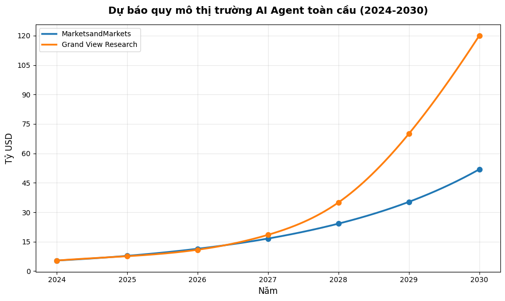
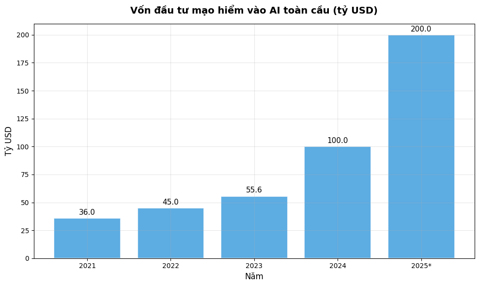
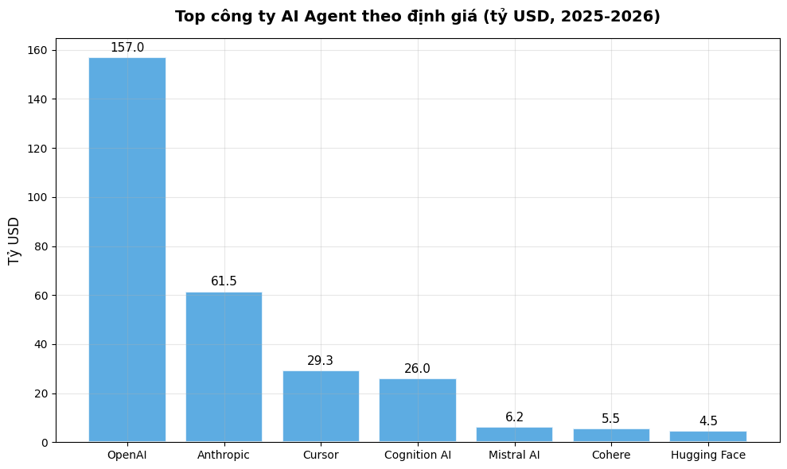
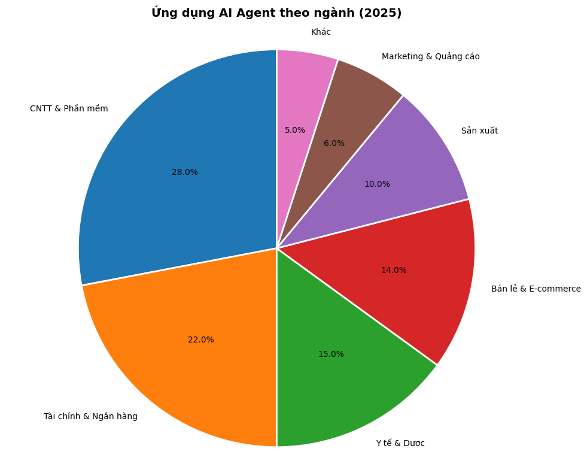
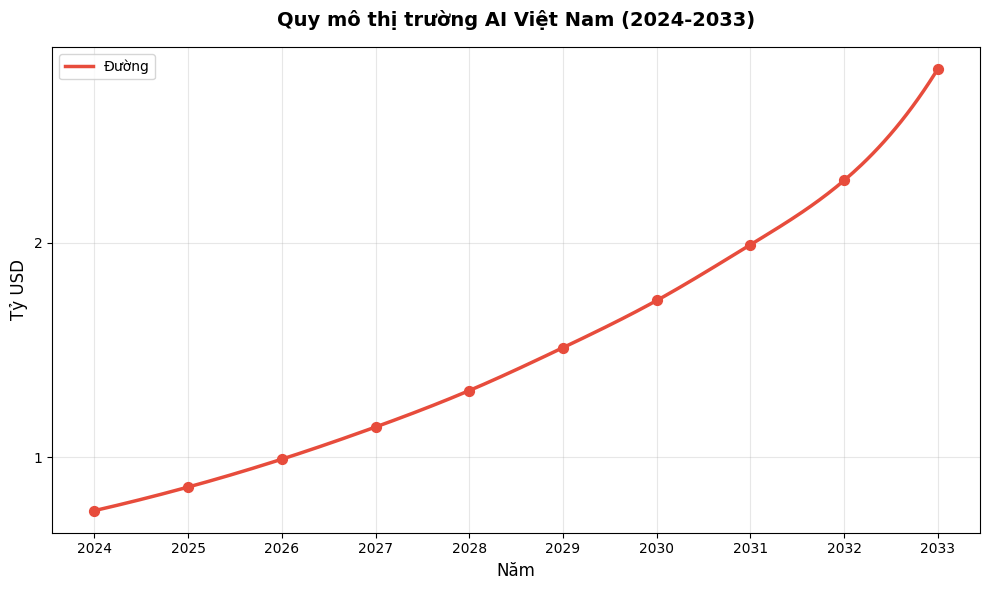

# 📊 Báo cáo Thị trường AI Agent 2024–2030

> **Ngày lập:** 19/06/2026  
> **Nguồn dữ liệu:** MarketsandMarkets, Grand View Research, CB Insights, McKinsey, Gartner, Mintz, PwC  
> **Mục đích:** Cung cấp bức tranh toàn cảnh về thị trường AI Agent cho người đọc non-tech

---

*Hình minh hoạ: AI Agent — Trợ lý trí tuệ nhân tạo tự hành*

---

## 1. AI Agent là gì?

**AI Agent** (Tác tử trí tuệ nhân tạo) là một chương trình hoặc hệ thống có khả năng:
- **Nhận thức** môi trường xung quanh
- **Tự ra quyết định** dựa trên mục tiêu được giao
- **Thực thi hành động** một cách tự chủ, không cần con người can thiệp từng bước

Khác với chatbot truyền thống (chỉ trả lời câu hỏi), AI Agent có thể **lên kế hoạch, sử dụng công cụ, và hoàn thành cả quy trình phức tạp** — từ viết code, nghiên cứu thị trường, đến quản lý dự án.

### Ví dụ thực tế:
| Loại AI Agent | Mô tả | Ví dụ |
|---|---|---|
| **Coding Agent** | Viết, debug, deploy code tự động | Devin (Cognition), Cursor, GitHub Copilot |
| **Customer Service Agent** | Xử lý yêu cầu khách hàng 24/7 | Amelia, Intercom AI |
| **Research Agent** | Thu thập, phân tích dữ liệu tự động | Perplexity, Elicit |
| **Workflow Agent** | Tự động hoá quy trình doanh nghiệp | Zapier AI, Microsoft Copilot |

---

## 2. Quy mô và Tốc độ Tăng trưởng Thị trường

### 2.1 Số liệu chính

| Chỉ số | Giá trị |
|---|---|
| **Quy mô 2024** | $5.4 tỷ USD |
| **Dự báo 2030** | $51.87 tỷ USD (MarketsandMarkets) |
| **Dự báo 2033** | $182.9 tỷ USD (Grand View Research) |
| **CAGR 2025-2030** | **45.8%** |
| **Thị trường Generative AI** | $37.1B (2024) → $220B (2030) |

> 💡 **Insight:** Tốc độ tăng trưởng 45.8% CAGR biến AI Agent trở thành một trong những phân khúc tăng nhanh nhất trong lịch sử công nghệ, vượt xa cả cloud computing giai đoạn đầu (~25% CAGR).

### 2.2 Biểu đồ Dự báo Quy mô Thị trường

*Nguồn: MarketsandMarkets & Grand View Research, 2025*

### 2.3 Động lực tăng trưởng chính

1. **Nhu cầu tự động hoá** — Doanh nghiệp cần giảm chi phí vận hành, tăng hiệu suất
2. **Tiến bộ NLP & LLM** — GPT-4, Claude, Gemini cho phép agent hiểu và thực thi ngôn ngữ tự nhiên
3. **Multi-modal AI** — Agent xử lý đồng thời văn bản, hình ảnh, video, code
4. **Áp lực cạnh tranh** — 88% tổ chức đã triển khai AI ít nhất 1 chức năng (McKinsey 2025)

---

## 3. Đầu tư và Funding

### 3.1 Bùng nổ vốn đầu tư

| Năm | VC Funding vào AI | Tăng trưởng YoY |
|---|---|---|
| 2022 | ~$45 tỷ | — |
| 2023 | $55.6 tỷ | +24% |
| 2024 | **>$100 tỷ** | **+80%** |
| 2025* | ~$200 tỷ+ | +100% |

*Nguồn: Mintz Research, CB Insights State of AI 2025*

> 💡 **Insight:** Năm 2024 đánh dấu cột mốc lịch sử — lần đầu tiên vốn VC đổ vào AI vượt $100 tỷ, gấp đôi năm trước. LLM developers chiếm 41% tổng đầu tư.

### 3.2 Biểu đồ Vốn đầu tư AI

*Nguồn: CB Insights, Mintz Research*

---

## 4. Các Công ty AI Agent Hàng đầu

### 4.1 Bảng xếp hạng theo Định giá

| Công ty | Định giá | Funding gần nhất | Sản phẩm chính |
|---|---|---|---|
| **OpenAI** | $157 tỷ | $40B (2025) | GPT-4o, Operator Agent |
| **Anthropic** | $61.5 tỷ | $15B (2025) | Claude, Computer Use |
| **Cursor** | $29.3 tỷ | $2.3B Series D | AI Code Editor |
| **Cognition AI** | $26 tỷ | $1B Series D | Devin (AI Software Engineer) |
| **Mistral AI** | $6.2 tỷ | €600M (2024) | Mistral Large, Le Chat |
| **Cohere** | $5.5 tỷ | $500M (2024) | Enterprise AI Platform |
| **Hugging Face** | $4.5 tỷ | $235M (2023) | Open-source AI Hub |

### 4.2 Biểu đồ Định giá Top Công ty AI Agent

*Nguồn: TechFundingNews, SiliconANGLE, 2025-2026*

### 4.3 Case Study: Cognition AI (Devin)

🔹 **Câu chuyện tăng trưởng thần tốc:**
- 03/2024: Ra mắt Devin — AI software engineer đầu tiên
- 09/2024: ARR $1 triệu
- 06/2025: ARR $73 triệu (tăng 73x trong 9 tháng!)
- 2026: ARR ~$492 triệu, định giá $26 tỷ
- Devin tự viết **>90% codebase** của chính Cognition

🔹 **Bài học:** Thị trường AI Agent coding đang bùng nổ — Cursor ($29.3B), GitHub Copilot (hàng triệu user), và Cognition ($26B) đều đạt unicorn status trong chưa đầy 2 năm.

---

## 5. Ứng dụng AI Agent theo Ngành

### 5.1 Tỉ lệ Áp dụng

*Nguồn: MarketsandMarkets, Gartner, 2025*

### 5.2 Top Use Cases theo Ngành

#### 🖥️ CNTT & Phần mềm (28%)
- **Coding Agent:** Viết code, review PR, deploy tự động
- **DevOps Agent:** Giám sát hệ thống, tự xử lý incident Level 0-1
- **Testing Agent:** Tự generate test case, chạy regression

#### 🏦 Tài chính & Ngân hàng (22%)
- **Trading Agent:** Phân tích thị trường real-time, ra quyết định giao dịch
- **Risk Agent:** Đánh giá rủi ro tín dụng, phát hiện gian lận
- **Compliance Agent:** Kiểm tra tuân thủ pháp luật tự động

#### 🏥 Y tế & Dược (15%)
- **Diagnostic Agent:** Hỗ trợ chẩn đoán từ hình ảnh y khoa
- **Drug Discovery Agent:** Tìm kiếm hợp chất tiềm năng
- **Patient Care Agent:** Theo dõi, nhắc nhở bệnh nhân

#### 🛒 Bán lẻ & E-commerce (14%)
- **Shopping Agent:** Tư vấn sản phẩm cá nhân hoá
- **Pricing Agent:** Điều chỉnh giá theo thời gian thực
- **Inventory Agent:** Dự báo tồn kho, tự đặt hàng

#### 🏭 Sản xuất (10%)
- **Predictive Maintenance Agent:** Dự báo hỏng hóc thiết bị
- **Quality Control Agent:** Phát hiện lỗi sản phẩm bằng vision AI
- **Supply Chain Agent:** Tối ưu chuỗi cung ứng

### 5.3 Mức độ Áp dụng Enterprise

| Chỉ số | Số liệu | Nguồn |
|---|---|---|
| Apps tích hợp AI Agent | **80%** | Gartner Q1/2026 |
| Tổ chức dùng AI ≥1 chức năng | **88%** | McKinsey 2025 |
| Tổ chức scale Agentic AI | **23%** | S&P Global |
| Agent chạy production thực tế | **31%** | S&P Global |
| Doanh thu app có AI tăng | **+78%** | Google e-Conomy SEA 2025 |

> 💡 **Gap lớn nhất:** 80% app đã nhúng AI Agent, nhưng chỉ 31% tổ chức thực sự đưa vào production → Cơ hội khổng lồ cho consulting, implementation, và training.

---

## 6. Thị trường Việt Nam và Đông Nam Á

### 6.1 Việt Nam — Dẫn đầu Đông Nam Á về Tốc độ Áp dụng AI

| Chỉ số | Giá trị |
|---|---|
| **Quy mô thị trường AI 2024** | $0.75 tỷ USD |
| **Dự báo 2033** | $2.81 tỷ USD |
| **CAGR 2025-2033** | 14.96% |
| **Số startup AI đang hoạt động** | 40+ |
| **Vốn đầu tư tư nhân AI (2024)** | $123 triệu |
| **Tỉ lệ dùng AI hàng ngày** | 81% người dùng |
| **Doanh thu app tích hợp AI tăng** | +78% (H1/2025) |

### 6.2 Biểu đồ Quy mô Thị trường AI Việt Nam

*Nguồn: IMARC Group, 2025*

### 6.3 Các Doanh nghiệp AI Nổi bật tại Việt Nam

| Công ty | Lĩnh vực | Thành tựu |
|---|---|---|
| **FPT Software** | Enterprise AI | Doanh thu >$1.3 tỷ, AI services toàn cầu |
| **VinAI** | Research & Products | Top innovation Deloitte SEA 2024 |
| **MoMo** | Fintech + AI | 30M+ users, AI personalization |
| **Filum AI** | Customer Experience | Gọi vốn $1M, AI-driven CX |
| **VNPT AI** | Government AI | C-OCR xử lý nghìn văn bản/ngày |

### 6.4 Chính sách hỗ trợ

- 🇻🇳 **Luật Công nghệ số** (71/2025/QH15) — Luật AI đầu tiên của Việt Nam, có hiệu lực 2025
- 🇻🇳 **Chiến lược AI quốc gia** — Mục tiêu Việt Nam vào top 5 ASEAN về AI
- 🇻🇳 **"AI Việt Nam cho người Việt Nam"** — Chương trình phát triển AI nội địa
- 79% nhà đầu tư tin Việt Nam sẽ tiếp tục thu hút vốn AI (Google e-Conomy Report 2025)

### 6.5 Đông Nam Á — Thị trường AI tăng trưởng nhanh nhất

- Khu vực châu Á - Thái Bình Dương dự kiến có **tốc độ tăng trưởng cao nhất** trong thị trường AI Agent toàn cầu
- Động lực: Chuyển đổi số nhanh, dân số trẻ, chính phủ ủng hộ
- Singapore, Indonesia, Việt Nam dẫn đầu về AI adoption trong ASEAN

---

## 7. Xu hướng 2025-2030

### 7.1 Năm Xu hướng Chính

| # | Xu hướng | Mô tả |
|---|---|---|
| 1 | **Multi-Agent Systems** | Nhiều agent phối hợp giải quyết bài toán phức tạp |
| 2 | **Agentic AI in Enterprise** | Từ chatbot → agent tự hành trong workflow doanh nghiệp |
| 3 | **AI Agent Marketplaces** | Chợ mua bán/thuê agent chuyên biệt (như app store) |
| 4 | **Autonomous Coding** | Agent viết, test, deploy code không cần con người |
| 5 | **Physical AI Agents** | Robot + AI agent hoạt động trong thế giới thực |

### 7.2 Dự báo của Gartner

> *"Đến 2028, 33% ứng dụng enterprise sẽ tích hợp Agentic AI, tăng từ dưới 1% vào năm 2024."*
> — Gartner, 2025

### 7.3 Thách thức

- ⚠️ **Khoảng cách triển khai:** 80% có AI nhưng chỉ 31% production-ready
- ⚠️ **Thiếu nhân lực:** Nhu cầu AI specialist vượt xa cung
- ⚠️ **An toàn & Đạo đức:** Kiểm soát agent tự hành, bias, hallucination
- ⚠️ **Chi phí:** LLM inference vẫn đắt cho SME

---

## 8. Kết luận & Khuyến nghị

### Tóm tắt

| Khía cạnh | Kết luận |
|---|---|
| **Quy mô** | $5.4B → $51.87B (2024-2030), một trong những thị trường tăng nhanh nhất lịch sử tech |
| **Tốc độ** | CAGR 45.8% — nhanh gấp đôi cloud computing giai đoạn đầu |
| **Đầu tư** | >$100B VC funding 2024, tăng 80% YoY |
| **Adoption** | 88% tổ chức dùng AI, nhưng chỉ 23% scale được Agentic AI |
| **Việt Nam** | $0.75B → $2.81B, 81% dùng AI hàng ngày, dẫn đầu SEA |

### Khuyến nghị cho Doanh nghiệp Việt Nam

1. **Bắt đầu ngay** — Không cần hoàn hảo, hãy pilot AI Agent ở 1-2 quy trình lõi
2. **Ưu tiên use case có ROI rõ** — Customer service, coding, data analysis
3. **Đào tạo nhân sự** — Chuyển mindset từ "dùng tool" sang "quản lý agent"
4. **Xây dựng data foundation** — AI Agent cần dữ liệu sạch, có cấu trúc
5. **Theo dõi regulation** — Luật AI Việt Nam đang hình thành, cần comply sớm

---

## 📚 Nguồn tham khảo

1. MarketsandMarkets — AI Agents Market Report 2025-2030
2. Grand View Research — AI Agents Market Size & Trends 2026-2033
3. CB Insights — State of AI 2025 Report
4. McKinsey — State of AI 2025 Survey
5. Gartner — Enterprise AI Agent Adoption Q1/2026
6. Mintz — The State of Funding Market for AI Companies 2024-2025
7. PwC — AI Agent Survey 2025
8. Google — e-Conomy SEA Report 2025
9. IMARC Group — Vietnam AI Market Size & Forecast
10. Cognition AI — Funding & Growth Blog 2026

---

*Báo cáo được tổng hợp bởi AI, dữ liệu cập nhật đến tháng 6/2026.*
